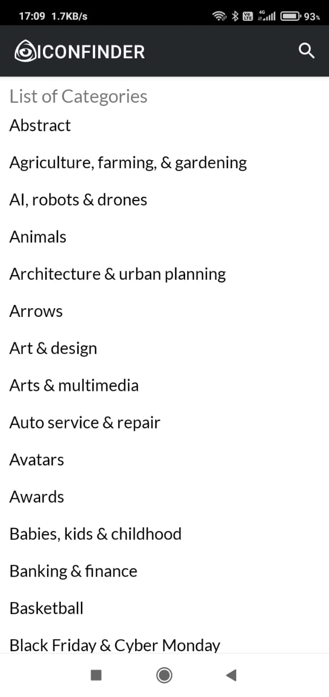
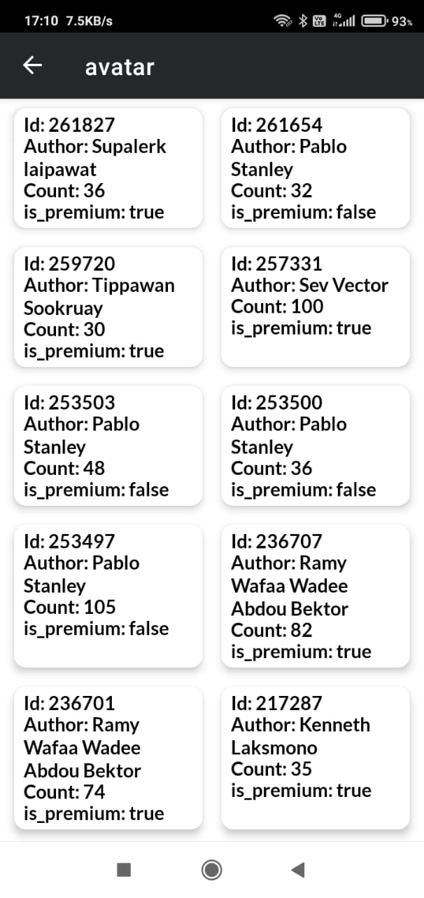
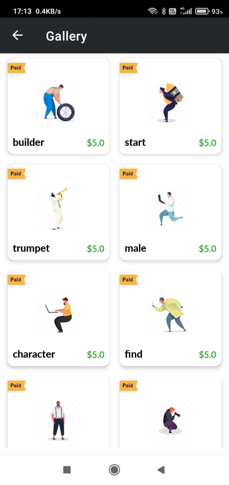
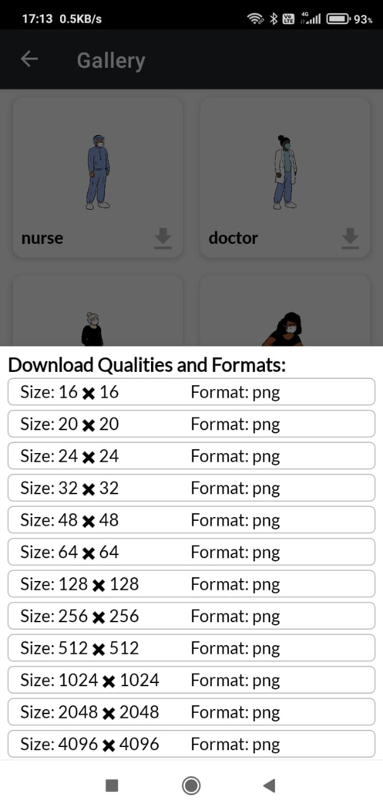
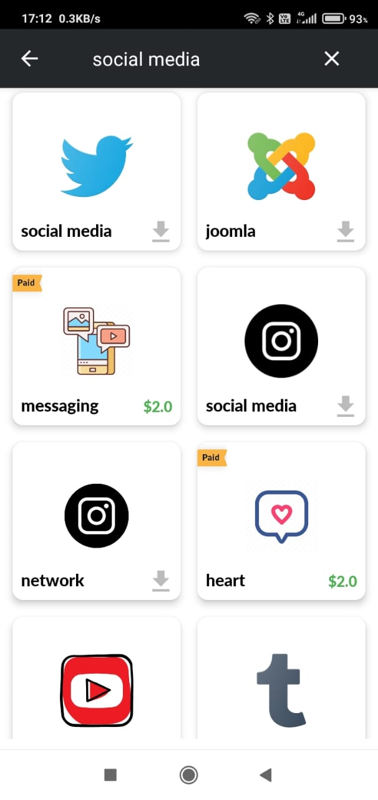

# Iconfinder-Search-App

## Introduction
The user can search Icon or select listed categories to find Icon, if the icon is free user can download it in different sizes.
I have used different Iconfinder APIs, Paging3 library for pagination, Retrofit for network calls, Hilt for dependency injection, and Glide for image processing.

## Technologies & Architecture 

#### Technologies
Android, Kotlin

### Architecture 
Model-View-ViewModel (MVVM)

#### Architecture Components
[ViewModel](https://developer.android.com/topic/libraries/architecture/viewmodel), [LiveData](https://developer.android.com/topic/libraries/architecture/livedata), 
[Navigation](https://developer.android.com/guide/navigation/),[Paging](https://developer.android.com/topic/libraries/architecture/paging/v3-overview)

#### External libraries 
[Retrofit](https://square.github.io/retrofit/) library for network call 
[Glide](https://github.com/bumptech/glide) library for image processing  
[Hilt](https://developer.android.com/training/dependency-injection/hilt-android) library for dependency injection.

## Features

**Search:** Search Icon 

**Download:** Download free icons

**IconSets** List of IconSets 

## Screenshots

### Categories | IconSets | Icons

      
      
      

### Download Bottom Sheet | Search 

      
      

